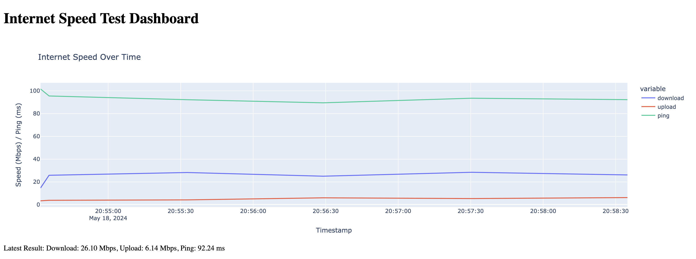

# Internet Speed Test Dashboard with Python 

This project provides a web dashboard to monitor internet speed over time. It runs periodic speed tests and visualizes the results using a Plotly Dash application.

## Features

- **Real-time Speed Test**: Runs speed tests every minute.
- **Data Visualization**: Displays download, upload speeds, and ping over time.
- **Dockerized**: Easily deployable using Docker.

## Run with Docker

- Docker installed on your machine.
- docker run -p 8050:8050 abediniaaydin/speedtest-dashboard:v0.0.1

